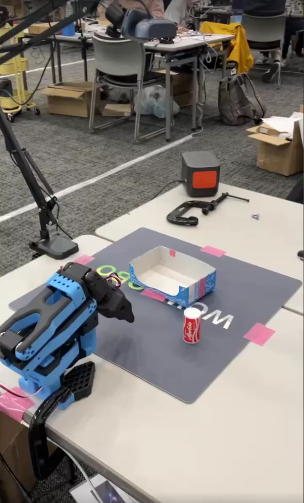
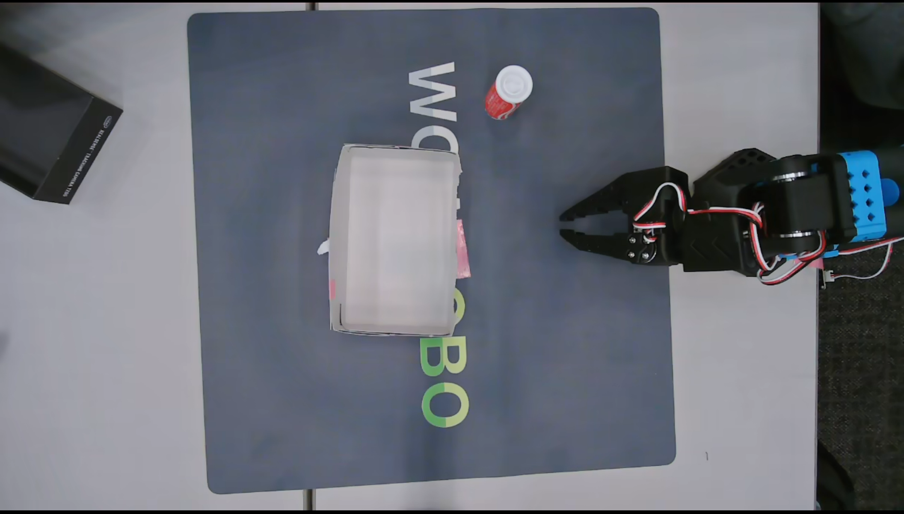

<div align="center">

<h1>AMD_Open_Robotics_Hackathon_2025_PackingMan</h1>

<h3>Dual-Arm Packing with Imitation Learning on AMD Instinct™ GPUs</h3>

**Team Nyap IV**  
Masakazu Sueyoshi · Hiroki Kyono  · Kosuke Tokuda

<br>

<sup>AMD Open Robotics Hackathon 2025</sup>

<br><br>

<a href="https://huggingface.co/datasets/yoshikokulala/simple_cola4">
  
</a>
<a href="https://huggingface.co/datasets/<HF_USERNAME>/<MISSION2_DATASET_ID>">
  
</a>
<a href="git clone https://huggingface.co/yoshikokulala/simple_cola4">
  
</a>
<a href="https://huggingface.co/<HF_USERNAME>/<MISSION2_MODEL_ID>">
  
</a>

</div>

---

# 🧾 Title
**AMD_RoboticHackathon2025-PackingMan**

---

# 👥 Team

**Team Name:** Nyap IV  

**Members:**

- Masakazu Sueyoshi  
- Kosuke Tokuda  
- Hiroki Kyono  

---
# 📝 Summary

**PackingMan is an automatic packing system that targets the “last human step” in modern e-commerce logistics: putting items into cardboard boxes.**

## Overview / Objective
This project develops a robotic system that performs the entire cardboard box packing workflow using a single imitation learning policy with dual arms.

In real logistics environments, packing operations still rely heavily on human skill, especially when dealing with variability, exception handling, material deformation, and fine contact-based adjustments—areas where traditional automation fails.

Our objective is to reproduce human-like adaptability and fine adjustment using imitation learning,enabling autonomous execution of real packing tasks rather than simple pick-and-place operations.

## Achieved / Planned Capabilities
All operations are executed under a single imitation learning policy using only RGB input
 - Placing a workpiece (cocoa cigarette package or cup) into a cardboard box
 - If the workpiece is a fragile cup, inserting cushioning material using a container (tool-use)
 - Closing the cardboard lid and accurately inserting lid flaps into the slit
 - Receiving tape from a human and sealing the box

##  Technical Core
### Unified Policy for Multiple Tasks
 - Workpiece grasping
 - Task switching (placement / cushioning / lid closing / taping)
 - Tool-use manipulation
 - Continuous adjustment with contact feedback
### RGB-Only Control
 - No point-clouds / CAD models / rigid-body simulation required
 - Robust to real-world variation, friction, deformation, and tolerances

## Why Imitation Learning? (Differentiation)
### Conventional Approach Limitation     
Rule-based control Fails with physical variation and unpredictable contact   

### Supervised learning 
Cannot represent continuous adjustment where no single correct label exists   

### Optimization / geometric computation 
Cannot handle bending cardboard, slit alignment, or material differences

### Strength of Imitation Learning
 - Learns successful trajectories directly
 - Captures sliding, pressing, pushing, micro-adjustments
 - Generalizes across variation (human handover differences, positioning, stiffness)
 - Enables robust execution of tool-use and human interaction

## Social Impact
 - Addresses the most manual and skill-dependent steps in logistics automation
 - Achieves robust behaviour using only RGB sensing with minimal hardware requirements
 - Proposes a pathway for skill preservation and transfer via imitation learning, rather than brute-force automation

This project tackles the core difficulty of real packing tasks—fine adjustment, contact handling, tool use, and human interaction—through a unified imitation learning policy.
Rather than simply automating movement, we aim to reproduce the essence of human skill, enabling deployment in real logistics environments.

---

# 🚀 How to Reproduce

Below is a minimal, end-to-end workflow.  
You can literally copy–paste this section and only change IDs / ports / camera configs as needed.

## 0. Environment Setup

We use Python 3.11, LeRobot, and AMD Instinct™ MI300X (CUDA-compatible interface).

```bash
# Create environment (example; adjust to your preference)
conda create -n amd_packingman python=3.11
conda activate amd_packingman

# Install LeRobot with π0 / ACT support
git clone https://github.com/huggingface/lerobot.git
cd lerobot
git checkout -b v0.4.1 v0.4.1
pip install -e ".[pi]"   # includes π0 dependencies

cd ..
```

You can then place this repository anywhere, e.g.:

```bash
git clone https://github.com/yoshiko-kulala/AMD_Robotics_Hackathon_2025_PackingMan.git
cd AMD_Robotics_Hackathon_2025_PackingMan
```

---

## 🧪 Mission 1 – Unified Task

### 1-1 Create Environment
This task needs devices below,
 - one SO-101
 - one Camera

Arrange your devices as shown in the image.



The camera image should look like this:




### 1-2. Inference / Evaluation

```bash
cd AMD_Robotics_Hackathon_2025_PackingMan

lerobot-act \
  --robot.type=so101_follower \
  --robot.port=/dev/ttyACM1 \
  --robot.cameras="{ front: {type: opencv, index_or_path: 0, width: 1280, height: 720, fps: 10} }" \
  --robot.id=mission1_follower_arm \
  --policy.repo_id=<HF_USERNAME>/<MISSION1_MODEL_ID> \
  --policy.device=cuda
```

This will load the trained Mission 1 policy from Hugging Face and execute it on the real robot.

---

## 📦 Mission 2 – PackingMan (Custom Task)

PackingMan focuses on **picking multiple objects and packing them into a box**, potentially with **dual-arm coordination**.

### 2-1. Data Collection (Teleoperation)

```bash
lerobot-record \
  --robot.type=so101_follower \
  --robot.port=/dev/ttyACM1 \
  --robot.cameras="{ front: {type: opencv, index_or_path: 4, width: 1280, height: 720, fps: 10} }" \
  --robot.id=packingman_follower_arm \
  --teleop.type=so101_leader \
  --teleop.port=/dev/ttyACM0 \
  --teleop.id=packingman_leader_arm \
  --dataset.repo_id=<HF_USERNAME>/<MISSION2_DATASET_ID> \
  --dataset.single_task='PackingMan – Packing Objects into Box' \
  --display_data=false
```

If you extend to **dual-arm control**, you can follow the hackathon’s dual-arm teleop configuration (left/right leader and follower arms) and log a combined state/action vector in the dataset.

---

### 2-2. Training on AMD Instinct™ GPU

```bash
lerobot-train \
  --dataset.repo_id=<HF_USERNAME>/<MISSION2_DATASET_ID> \
  --batch_size=128 \
  --steps=5000 \
  --output_dir=outputs/train/packingman \
  --job_name=packingman_dualarm \
  --policy.type=act \
  --policy.device=cuda \
  --policy.push_to_hub=true \
  --policy.repo_id=<HF_USERNAME>/<MISSION2_MODEL_ID> \
  --wandb.enable=true
```

- For dual-arm policies, the **action dimension** corresponds to the concatenation of both arms’ joint commands.
- Since MI300X has plenty of memory, you can experiment with **larger batch sizes** or **more steps** if time allows.

Copy the W&B `run-XXXX` directory of the **last successful training** into:

```text
mission2/wandb/
```

---

### 2-3. Running PackingMan Policy

```bash
lerobot-act \
  --robot.type=so101_follower \
  --robot.port=/dev/ttyACM1 \
  --robot.cameras="{ front: {type: opencv, index_or_path: 4, width: 1280, height: 720, fps: 10} }" \
  --robot.id=packingman_follower_arm \
  --policy.repo_id=<HF_USERNAME>/<MISSION2_MODEL_ID> \
  --policy.device=cuda
```

This command:

- Loads the trained PackingMan policy from Hugging Face.
- Runs it on your follower arm with the same camera setup used during recording.
- Allows you to reproduce the **final demo** shown during the hackathon.

---

# 🌐 Delivery URLs

Please fill in these URLs when everything is uploaded (structureはそのままコピペでOKです):

```text
Dataset (Mission 1):
https://huggingface.co/datasets/<HF_USERNAME>/<MISSION1_DATASET_ID>

Dataset (Mission 2 – PackingMan):
https://huggingface.co/datasets/<HF_USERNAME>/<MISSION2_DATASET_ID>

Model (Mission 1):
https://huggingface.co/<HF_USERNAME>/<MISSION1_MODEL_ID>

Model (Mission 2 – PackingMan):
https://huggingface.co/<HF_USERNAME>/<MISSION2_MODEL_ID>
```


---

# 🙏 Acknowledgement

- This work was conducted as part of **AMD Open Robotics Hackathon 2025**.
- We use:
  - **LeRobot** (Hugging Face) for imitation learning infrastructure.
  - **Hugging Face Hub** for hosting datasets and models.
  - **Weights & Biases** for experiment tracking.
- Special thanks to the organizers and supporting engineers for providing hardware, software templates, and technical guidance.

---

# 📜 License

Please choose and declare a license appropriate for your project (e.g., MIT, Apache-2.0):

```text
MIT License
```

*(必要に応じて他のライセンスに変更してください)*

---
